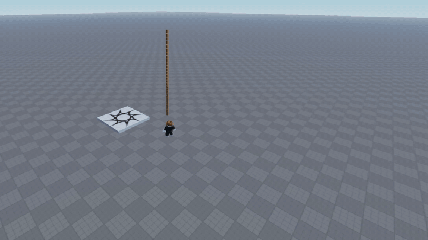
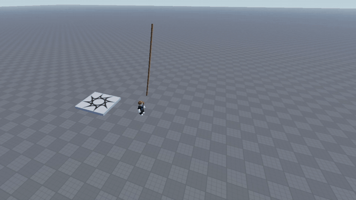
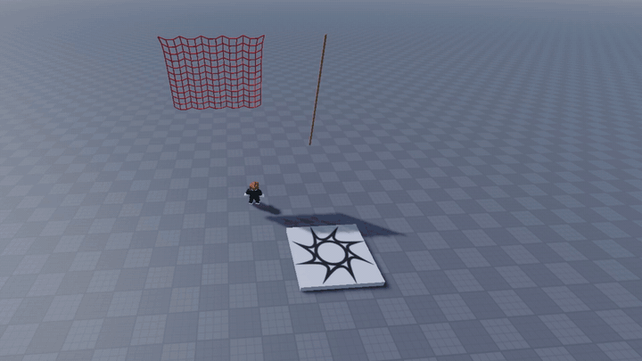
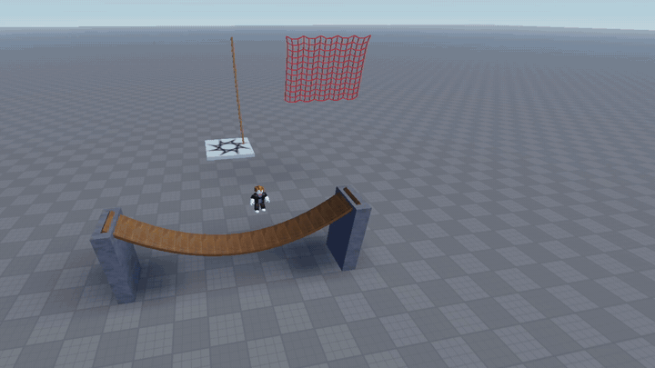

# progress

recorded in studio as i go, newest at the bottom

### 01 · first rope

30 sticks hanging off a pin, you can grab any point and fling it. pull hard and it stretches into a dotted line because the solver can't keep up, so next up was making it snap

### 02 · snapping

pull a stick past 2.5x its length and it breaks. it mostly goes at the pin end, not near the mouse, because that's where the tension piles up. stretched parts also grow to fill the gap now, and R gives you a fresh rope

### 03 · cloth

same solver, just a grid of points with sticks across and down, every third point on top pinned so it droops. tearing came for free, you can rip holes in it or tear whole strips off and carry them around. it's a net for now, a solid sheet would need a mesh

### 04 · bridge

planks pinned at both ends with a bit of slack so it sags, B drops crates on it. first go the crates went straight through. a crate was one big ball, so its corners sank into the sloped planks, then the bridge sprang back up and passed right through it. crates are 4 corners held square by sticks now and they sit properly. pile enough on and it snaps, then everything falls through the floor because nothing hits the world yet

